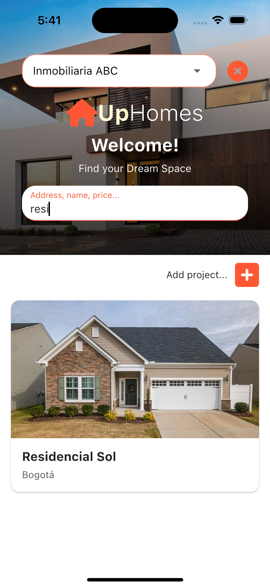
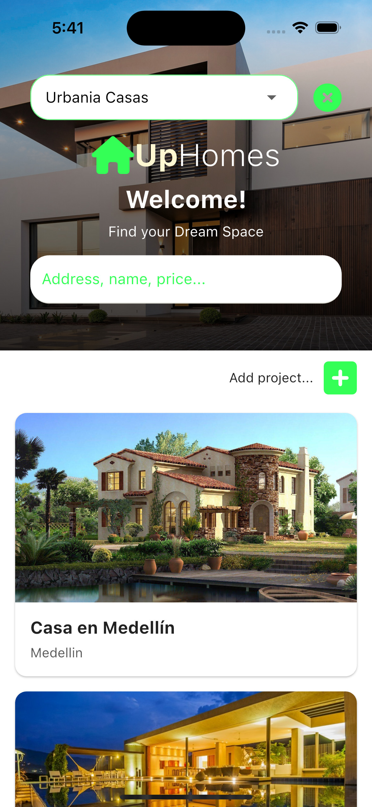
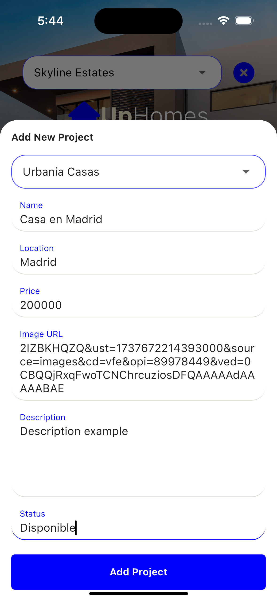

# Samay UpHomes test

[](https://flutter.dev)
[](LICENSE)
[](https://flutter.dev)
[](https://github.com/cristiancamilo070/uphomes_bt/commits/main)
[](https://github.com/cristiancamilo070/uphomes_bt/issues)
[](https://github.com/cristiancamilo070/uphomes_bt)

## Running the Flutter Project Locally

To run this Flutter project locally, follow these steps:

- Make sure you have Flutter and Dart installed on your machine.
- Clone the GitHub repository to your local machine using the following command:

```bash
git clone https://github.com/cristiancamilo070/uphomes_bt.git
```

- then run

```bash
flutter pub get
```

```bash
flutter run
```

# Frontend Overview

<div style="display: flex; flex-wrap: wrap; justify-content: space-between;">
  
  
  
</div>
<div style="display: flex; flex-wrap: wrap; justify-content: space-between;">
  
  
  
</div>
<div style="display: flex; flex-wrap: wrap; justify-content: space-between;">
  
  
  
</div>
<div style="display: flex; flex-wrap: wrap; justify-content: space-between;">
  
  
  
</div>
<div style="display: flex; flex-wrap: wrap; justify-content: space-between;">
  
  
  
</div>
<div style="display: flex; flex-wrap: wrap; justify-content: space-between;">
  
  
  
</div>

## Clean Architecture and Code

This Flutter frontend follows the principles of Clean Architecture and Clean Code, providing a structured and maintainable codebase.

---

## Features Implemented in the Project

1. **Bluetooth Integration**:

   - Integration with `flutter_blue_plus` for real Bluetooth device scanning, connection, and management.
   - Simulation of Bluetooth devices for testing without real hardware.
   - Signal strength (RSSI) displayed with corresponding icons:
     - **Green**: Strong signal.
     - **Blue**: Medium signal.
     - **Red**: Weak signal.

2. **Device Commands**:

   - Support for executing commands on both real and simulated devices:
     - `Turn On`
     - `Turn Off`
     - `Fetch Data`

3. **Dynamic UI**:

   - Real-time status updates for connected devices, including:
     - Device name.
     - Connection state.
     - Signal strength (RSSI).
   - Seamless integration of simulated devices alongside real devices.

4. **Database Export**:

   - Export SQLite databases from the app to the device's storage.
   - Option to specify custom export paths for debugging or analysis purposes.

5. **UI Enhancements**:

   - Responsive design compatible with multiple screen sizes.
   - Modern and clean UI adhering to Material Design principles.

6. **Clean Architecture**:

   - Code structured into three layers:
     - `Domain`: Business logic and entities.
     - `Data`: Repositories and data sources.
     - `Presentation`: UI and state management.
   - Use of `GetX` for efficient state management and dependency injection.

7. **Multilingual Support**:

   - Easy integration of translations with `.tr` for seamless localization.

8. **Project Filtering**:

   - Dynamic filtering of projects by:
     - Name.
     - Location.
     - Agency.
   - Integrated search functionality for better user experience.

9. **Edit and Delete Projects**:

   - Real-time UI updates for editing or deleting projects.
   - Smooth animations for transitions during user interactions.

10. **Error Handling**:

    - Comprehensive error handling for:
      - Bluetooth-related issues (e.g., Bluetooth not enabled).
      - Database export errors.
      - Connection failures.
    - User-friendly error messages and prompts.

11. **Theming**:
    - Dynamic theming based on user preferences or agency settings.

---

## How to Contribute

We welcome contributions to this project! Follow these steps to contribute:

1. Fork the repository.
2. Create a new branch for your feature or bug fix:
   ```bash
   git checkout -b feature/your-feature-name
   ```
